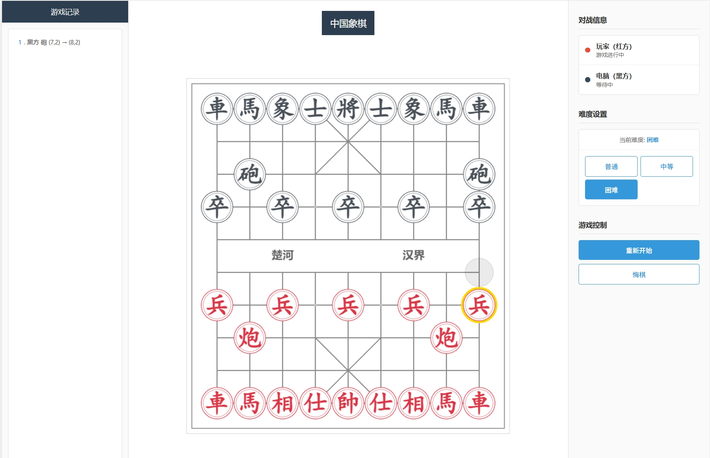

# 中国象棋 (Chinese Chess)

一个基于HTML5 Canvas和JavaScript开发的中国象棋游戏，支持人机对战，具有智能AI对手和现代化的用户界面。

**开发工具**: Claude Code + GLM-4.6



## 🎮 游戏特色

### 核心功能
- **人机对战**：与AI对手进行对弈，支持多种难度级别
- **智能AI**：基于Minimax算法和Alpha-Beta剪枝的AI引擎
- **Web Worker**：AI计算在独立线程中运行，不阻塞UI界面
- **悔棋功能**：支持两步悔棋（AI+玩家各一步）
- **将军检测**：自动检测将军和将死状态
- **移动记录**：实时显示游戏进程和移动历史

### 界面设计
- **三栏布局**：游戏记录（左）+ 棋盘（中）+ 控制面板（右）
- **响应式设计**：适配不同屏幕尺寸
- **现代化UI**：简洁美观的界面设计
- **状态指示**：实时显示双方玩家状态
- **Toast提示**：友好的消息提示系统

## 🎯 游戏规则

### 基本规则
- 红方（玩家）先行，黑方（电脑）后走
- 双方轮流走棋，每次只能移动一个棋子
- 目标是将死对方的将/帅

### 棋子移动规则
- **将/帅**：只能在九宫格内移动，每次一格
- **士/仕**：只能在九宫格内斜线移动
- **象/相**：走田字，不能过河
- **马**：走日字，注意蹩脚
- **车**：直线移动，无距离限制
- **炮**：直线移动，吃子需要跳过一个棋子
- **兵/卒**：过河前只能前进，过河后可左右移动

## 🚀 快速开始

### 安装和运行
1. 克隆或下载游戏文件
```bash
git clone [repository-url]
cd chinese_chess
```

2. 使用浏览器打开
```bash
# 直接用浏览器打开index.html
# 或使用本地服务器
python -m http.server 8000
# 然后访问 http://localhost:8000
```

### 游戏操作
1. 点击"开始游戏"按钮开始对弈
2. 点击红方棋子选中，再点击目标位置移动
3. 使用"悔棋"按钮撤销最近的移动
4. 使用"重新开始"按钮重置游戏

## 🤖 AI难度级别

游戏提供三个难度级别：

| 难度 | 搜索深度 | 特点 | 适合人群 |
|------|----------|------|----------|
| 普通 | 3层 | 基础策略，反应快 | 初学者 |
| 中等 | 4层 | 平衡的策略和反应速度 | 一般玩家 |
| 困难 | 5层 | 深度思考，策略强 | 高级玩家 |

### AI特性
- **开局策略**：多样化的开局选择，避免重复
- **位置评估**：基于棋子价值和位置的综合评分
- **随机性**：增加走法的随机性，提高游戏趣味性

## 🛠️ 技术实现

### 核心技术
- **HTML5 Canvas**：棋盘和棋子渲染
- **JavaScript ES6+**：游戏逻辑实现
- **CSS Grid**：响应式布局设计
- **Web Workers**：AI计算多线程处理

### AI算法
- **Minimax算法**：递归搜索最优解
- **Alpha-Beta剪枝**：优化搜索效率
- **位置评估函数**：棋局局势分析
- **移动验证**：完整的象棋规则实现

### 性能优化
- **DOM缓存**：减少DOM查询
- **Canvas优化**：高效的图形渲染
- **事件优化**：智能的事件处理
- **内存管理**：自动清理资源

## 📁 项目结构

```
chinese_chess/
├── index.html          # 主页面
├── styles.css          # 样式文件
├── script.js           # 游戏逻辑
├── README.md           # 说明文档
└── screen_shot.png     # 游戏截图
```

### 主要组件
- **ChineseChess类**：游戏主控制器
- **AI Worker**：独立AI计算线程
- **Canvas渲染器**：棋盘和棋子绘制
- **事件管理器**：用户交互处理

## 🎨 界面说明

### 左侧面板 - 游戏记录
- 显示完整的移动历史
- 棋谱记录格式化显示
- 自动滚动到最新记录

### 中央面板 - 棋盘
- 标准中国象棋棋盘
- 楚河汉界分明
- 棋子点击交互
- 可移动位置提示

### 右侧面板 - 控制区
- **对战信息**：显示双方玩家状态
- **难度设置**：选择AI难度级别
- **游戏控制**：开始、重新开始、悔棋

## 🔧 自定义和扩展

### 修改AI难度
```javascript
// 在script.js中修改搜索深度
getSearchDepthByDifficulty() {
    const difficultyLevels = {
        'medium': 3,  // 调整这个值
        'hard': 4,    // 调整这个值
        'expert': 5   // 调整这个值
    };
    return difficultyLevels[this.gameDifficulty];
}
```

### 自定义棋盘样式
```css
/* 在styles.css中修改棋盘样式 */
.board {
    border: 2px solid #8B4513;
    background: #F5DEB3;
}
```

### 添加新功能
游戏采用模块化设计，可以轻松扩展：
- 添加音效支持
- 实现在线对战
- 添加棋谱分析
- 支持自定义主题

## 🐛 问题反馈

如果您在使用过程中遇到问题，请检查以下常见问题：

### 常见问题
1. **AI不响应**：检查浏览器控制台是否有错误信息
2. **棋子无法移动**：确认该移动符合象棋规则
3. **界面显示异常**：尝试刷新页面重新加载

### 已知限制
- 目前只支持人机对战
- 不支持棋谱保存和加载
- 移动设备适配需要进一步优化

## 📄 许可证

本项目采用 [MIT 许可证](LICENSE)。

---

Copyright (c) 2024

Permission is hereby granted, free of charge, to any person obtaining a copy
of this software and associated documentation files (the "Software"), to deal
in the Software without restriction, including without limitation the rights
to use, copy, modify, merge, publish, distribute, sublicense, and/or sell
copies of the Software, and to permit persons to whom the Software is
furnished to do so, subject to the following conditions:

The above copyright notice and this permission notice shall be included in all
copies or substantial portions of the Software.

THE SOFTWARE IS PROVIDED "AS IS", WITHOUT WARRANTY OF ANY KIND, EXPRESS OR
IMPLIED, INCLUDING BUT NOT LIMITED TO THE WARRANTIES OF MERCHANTABILITY,
FITNESS FOR A PARTICULAR PURPOSE AND NONINFRINGEMENT. IN NO EVENT SHALL THE
AUTHORS OR COPYRIGHT HOLDERS BE LIABLE FOR ANY CLAIM, DAMAGES OR OTHER
LIABILITY, WHETHER IN AN ACTION OF CONTRACT, TORT OR OTHERWISE, ARISING FROM,
OUT OF OR IN CONNECTION WITH THE SOFTWARE OR THE USE OR OTHER DEALINGS IN THE
SOFTWARE.

## 🤝 贡献

欢迎提交Issue和Pull Request来改进游戏。

---

**享受对弈的乐趣！** ♟️♟️